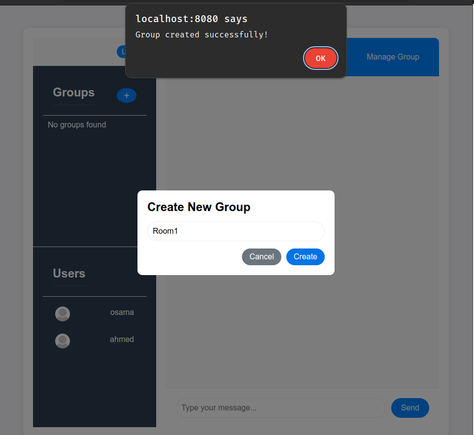

# Real-Time Chat Application

A real-time chat application built with Node.js, Express, Prisma, and Socket.io. Supports individual chats, group messaging, and JWT-based authentication.

## Features

- **Real-Time Messaging**: Socket.io for instant message delivery.
- **Group Chats**: Create groups, add/remove members, and send messages.
- **Authentication**: JWT token-based user authentication.
- **REST API**: Endpoints for users, messages, groups, and authentication.

## Technologies

- **Backend**: Node.js, Express
- **Database**: Prisma ORM (MySQL database)
- **WebSocket**: Socket.io
- **Authentication**: JWT

---
##  Database Desing 


## Screenshots                  
###  Real-Time Chat Between Two Users (Live via Socket.io)
**Description**: Live one-on-one chat interface demonstrating real-time messaging powered by Socket.io. Features message history and active user indicators.
|


---

### Create Group (API)

**Description**:API-driven group creation interface showing form fields and validation. Demonstrates REST API integration


---
### Chatting In Group whit Member (Live  Socket.io)

**Description**: Live group messaging interface demonstrating:  
-  Simultaneous multi-user participation  
-  Message threading with timestamps  
-  Socket.io-powered real-time updates  


---
###  Manage Group Members 
**Description**: Group administration panel 


## API Endpoints

### Authentication
| Method | Route      | Description                     | Protected |
|--------|------------|---------------------------------|-----------|
| POST   | `/login`   | User login                      | No        |
| POST   | `/signup`  | User registration               | No        |
| GET    | `/users`   | Fetch all registered users      | Yes       |

---

### Messages & Chats
| Method | Route                  | Description                          | Protected |
|--------|------------------------|--------------------------------------|-----------|
| GET    | `/:chatId`             | Get all messages in a chat           | Yes       |
| POST   | `/:chatId`             | Send a message to a chat             | Yes       |
| POST   | `/:senderId/:reciverI` | Create a new chat between two users  | Yes       |
| GET    | `/:senderId/:reciverI` | Check if a chat exists between users | Yes       |

---

### Groups
| Method | Route                     | Description                          | Protected |
|--------|---------------------------|--------------------------------------|-----------|
| GET    | `/groups/:userId`         | Get all groups for a user            | Yes       |
| POST   | `/create`                 | Create a new group                   | Yes       |
| GET    | `/:groupId`               | Get old messages from a group        | Yes       |
| POST   | `/:userId/:groupId`       | Add a member to a group              | Yes       |
| GET    | `/:userId/:groupId`       | List all members in a group          | Yes       |
| DELETE | `/:userId/:groupId`       | Remove a member from a group         | Yes       |
| POST   | `/`                       | Send a message to a group (via Socket) | Yes       |

---

## WebSocket Events (Socket.io)

### Joining Chats/Groups
- **Event**: `join-group`
  - **Data**: `{ groupId }`
  - **Action**: Join a group room (`group_<groupId>`).

- **Event**: `join-chat`
  - **Data**: `{ chatId }`
  - **Action**: Join a chat room (`chat_<chatId>`).

---

### Sending Messages
1. **Individual Chat**:
   - **Event**: `message`
   - **Data**: 
     ```json
     {
       "senderId": "user123",
       "content": "Hello!",
       "chatId": "chat456"
     }
     ```
   - **Response**: Emits `message` to all in `chat_<chatId>`.

2. **Group Chat**:
   - **Event**: `messageInGroup`
   - **Data**: 
     ```json
     {
       "groupId": "group789",
       "senderId": "user123",
       "content": "Hi group!"
     }
     ```
   - **Response**: Emits `messageInGroup` to all in `group_<groupId>`.


---


